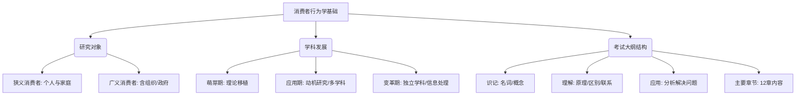
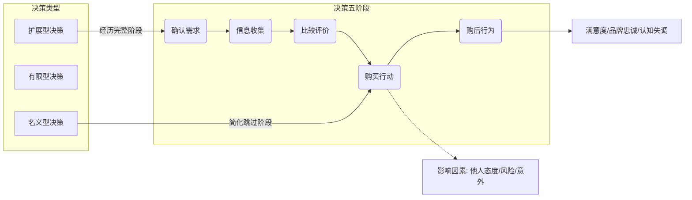
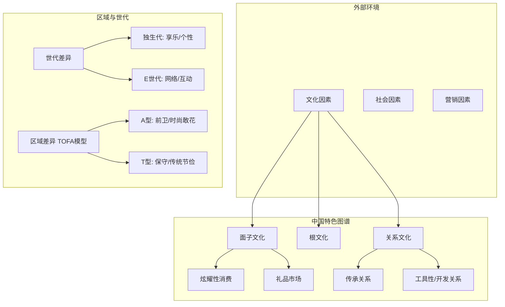

根据您提供的四份PDF文档内容，主要是关于《消费者行为学》的考试大纲、核心概念定义、复习重点笔记以及中国消费者行为的本土化分析。

我将这些内容梳理为四个核心板块，每个板块包含Markdown整理的知识点和Mermaid思维导图。

### 第一板块：课程概况与基础理论架构

这一部分涵盖了课程的考试大纲要求、消费者行为学的定义、历史发展及研究对象。

#### 1. 核心知识点

* **课程性质与考核目标**
  * **核心课程**：市场营销专业。
  * **考核层次**：识记（25%）、理解（50%）、应用（25%）。
  * **考试形式**：闭卷笔试，满分100分，时间120分钟。
* **基本概念定义**
  * **消费者行为学**：研究消费者在获取、使用、消费、处置产品和服务过程中发生的心理活动特征和行为规律的科学。
  * **消费者分类**：
    * **广义**：购买、使用各种产品与服务的个人与组织（含企业、政府）。
    * **狭义**：购买使用各种消费品的个人与家庭（本课程主要研究对象）。
* **学科发展阶段**
  * **萌芽时期**：理论主要来自经济学/心理学，未广泛应用。
  * **应用时期**：针对动机的研究增多，多学科参与。
  * **变革与发展时期**：成为独立学科，跨文化研究，重视信息处理。

#### 2. 知识架构图 (Mermaid)



---

### 第二板块：消费者购买决策过程

这一部分是课程的核心流程，详细描述了从需求确认到购后行为的全过程及其类型。

#### 1. 核心知识点

* **决策过程五阶段模型**
  1. **确认需求**：理想状态与现实状态的差距（来源：商品不足、新信息、需求扩大）。
  2. **信息收集**：记忆来源（内部）、个人来源（亲友）、大众来源（媒体）、商业来源（广告）、经验来源（试用）。
  3. **比较评价**：使用评价标准和替代指示器。
  4. **购买决策**：受他人态度、购买风险、意外情况影响。
  5. **购后行为**：满意/不满意（预期满意理论、认识差距理论）、认知失调、处置。
* **购买决策类型**
  * **名义型决策**：习惯性购买，介入度最低，几乎无信息搜索。
  * **有限型决策**：介入度中等，少量信息搜索。
  * **扩展型/复杂型决策**：介入度最高，广泛搜索信息，多用于高风险/新产品。
* **购买角色**
  * **倡议者**、**影响者**、**决策者**、**购买者**、**使用者**。
* **知觉风险**
  * 类型：功能、物质、经济、社会、心理风险。
  * 降低方法：获取信息、品牌忠诚、从名牌处购买、寻求保证。

#### 2. 决策流程图 (Mermaid)



---

### 第三板块：消费者心理与个体因素（内部影响）

这一部分探讨影响消费者的内部心理机制，如动机、感知、学习和态度。

#### 1. 核心知识点

* **需要与动机**
  * **马斯洛需求层次**：生理 -> 安全 -> 社交 -> 尊重 -> 自我实现。
  * **动机冲突**：
    * **双趋冲突**：两个都想要（鱼与熊掌）。
    * **趋避冲突**：既想接近又想回避（想吃甜食怕胖）。
    * **双避冲突**：两个都想躲（前有狼后有虎）。
  * **双因素理论**：保健因素（必备）与激励因素（锦上添花）。
* **知觉与注意**
  * **展露 -> 注意 -> 理解 -> 记忆**。
  * **韦伯定律**：刺激变化量与初始强度的比值是常数（ΔI/I=K），用于价格调整或包装改变。
* **学习与记忆**
  * **行为学习**：经典性条件反射（巴甫洛夫）、操作性条件反射（强化/惩罚）。
  * **认知学习**：模仿、推理。
* **态度**
  * **构成 (ABC模型)**：认知 (Cognition)、情感 (Affect)、意动 (Behavior)。
  * **改变过程**：顺从 -> 认同 -> 内化。
* **个性与自我概念**
  * **自我概念**：实际的自我、理想的自我、社会的自我、理想的社会自我。
  * **生活方式**：AIO问卷（活动、兴趣、意见）。

#### 2. 内部因素思维导图 (Mermaid)

```mermaid
mindmap
  root((消费者内部因素))
    动机与需要
      马斯洛五层次
      双因素理论
      动机冲突
        (双趋冲突)
        (趋避冲突)
        (双避冲突)
    感知与知觉
      展露与注意
      韦伯定律
      知觉风险
    学习机制
      行为学习
        经典条件反射
        操作条件反射
      认知学习
    态度
      ABC模型
      改变阶段
        顺从
        认同
        内化
    个性与自我
      自我概念类型
      "生活方式 (AIO)"

```

---

### 第四板块：环境因素与中国本土化特征（外部影响）

这一部分重点在于文化、社会阶层以及中国特定的消费文化背景。

#### 1. 核心知识点

* **文化因素**
  * **文化价值观**：他人导向、环境导向、自我导向。
  * **亚文化**：民族、宗教、地理区域。
* **中国特色消费行为**
  * **面子文化**：涉及广泛人群，重“看”不重“用”，地位决定档次，礼品消费。
  * **根文化**：崇拜消费、神圣消费（祭祖、落叶归根）。
  * **关系营销 (Guanxi)**：传承关系（血缘）、嵌入关系（社会角色）、渐生关系（生活圈）、开发关系（利益）。
  * **世代差异**：
    * **独生代**：小皇帝，早熟，个性酷，享乐主义，月光族。
    * **E世代**：数字原住民，追求互动和体验。
* **区域消费差异 (TOFA模型)**
  * **时尚指数 (Style)** vs **花钱指数 (Risk)**。
  * **A型 (高S高R)**：前卫型，敢花钱，追新潮。
  * **F型 (低S高R)**：理财型/时尚而精明。
  * **O型 (低S高R-原文可能有误，通常对应不同组合)**：乐天型（传统而敢花钱）。
  * **T型 (低S低R)**：保守型，传统节俭。
* **社会与情境因素**
  * **社会阶层**：影响购买力与偏好。
  * **参照群体**：意见领袖、口碑传播。
  * **情境**：物质环境、时间压力、购买任务。

#### 2. 外部与文化因素图示 (Mermaid)


